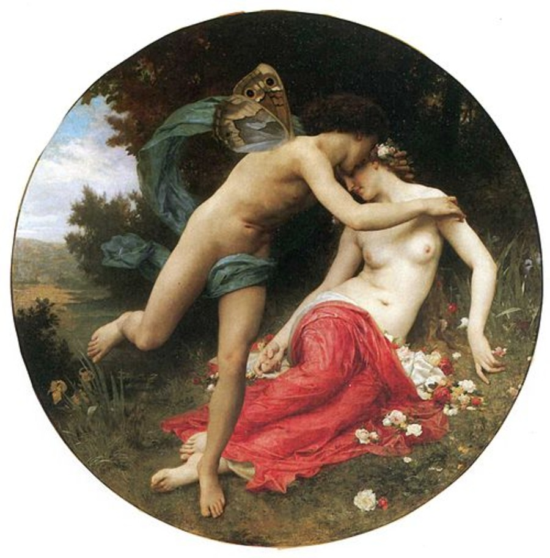

*Artículo publicado originalmente en valenciano en la [Revista Espores](https://espores.org/es/es-jardineria/de-cloris-al-florecimiento-de-la-vida-flores-coevolucion-y-prosperidad/).*

**Las flores revelan secretos fascinantes sobre reproducción vegetal, coevolución de especies y conservación ambiental. Acompañadnos en un recorrido por la botánica, la ecología, la historia y la cultura que nos invita a reflexionar sobre cómo nos relacionamos con ellas y, además, cómo favorecer la biodiversidad, la sostenibilidad y, por qué no, la belleza.**

Hoy quiero hablar de las flores, y como me gustan las historias de la mitología, especialmente la griega, comenzaré con una historia que me viene perfecta para el tema: el mito de Cloris y Céfiro.

Cloris era una ninfa terrestre que vivía en las praderas y cuidaba las plantas. Céfiro, el dios-viento del oeste, la raptó, y le otorgó el poder de la floración. Así se transformó en la diosa de las flores y la vegetación primaveral. Tuvieron dos hijas: la Primavera, y Karpos, la diosa de los frutos y las cosechas.

Imagen 1: *Flora y Céfiro* (1875), de William-Adolphe Bouguereau. El viento del oeste favorece la floración y fertiliza las plantas, creando más vida. Fuente: [*Musée des Beaux Arts de Mulhouse*](beaux-arts.musees-mulhouse.fr/collections/) (Alsàcia)

Aunque es discutible que la primavera sea hija de la diosa de las flores y no al revés, el mito refleja cómo los griegos entendían la conexión entre las estaciones, la meteorología, y la botánica, así como la relación de los frutos respecto a las flores. Para comprenderlo mejor, debemos entender cada componente desde un punto de vista científico.

# ¿Qué es una flor?

Las flores son los órganos sexuales donde se producen los gametos, células que al unirse forman un nuevo individuo, y pueden ser masculinos (polen) o femeninos (óvulos). La mayoría de plantas (70-90%) son hermafroditas, con los dos tipos de gametos en la misma flor. Las plantas monoicas (5-7%) producen un tipo en cada flor, y las dioicas (6-7%) solo un tipo cada individuo. Los términos monoico y dioico vienen del griego, _mono_ o _di_, uno y dos, y _oikos_, casa.

No todas las plantas tienen flores; solo las espermatófitas (con semillas), que son de hecho la inmensa mayoría (cerca del 90%), salvo los helechos y los musgos, entre otros. Pueden ser de dos tipos: las gimnospermas ("semillas desnudas"), que solo comprenden el 0,3%, entre las que encontramos el pino, el ciprés, el cedro, el abeto y el ginkgo; y las angiospermas ("semillas en recipiente"), que las tienen en un fruto, son posteriores y comprenden la gran mayoría restante.

# La polinización, la floración y la primavera

Ahora bien, todas las flores realizan la polinización: la llegada del polen al óvulo. Como tienen una movilidad muy reducida, emplean diversos mecanismos para hacerlo: el viento (anemofilia), los animales (zoofilia), el agua (hidrofilia) o medios propios (autogamia). El sufijo -filo significa "con afinidad por". Normalmente las gimnospermas son anemófilas y las angiospermas son zoófilas.

Por otra parte, muchas angiospermas también se pueden reproducir vegetativamente, es decir, de manera asexual, mediante estolones, bulbos o esquejes, entre otros, sin involucrar las flores. Pero en este caso la descendencia es idéntica, limitando la variabilidad genética.

La mayoría de plantas producen flores en primavera porque es cuando las condiciones son más óptimas para su reproducción: temperaturas más cálidas pero moderadas, más horas de luz (fotoperiodo), humedad, lluvias, mucha actividad biológica... Es cuando más sopla en el Mediterráneo el viento del oeste, suave y favorable.

[Cuadro *La Primavera* (1480), de Sandro Botticelli](attachments/cloris/primavera-botticelli-1480-mitologia-flores.jpg)
Imagen 2: *La Primavera* (1480), de Sandro Botticelli. Aparecen, de derecha a izquierda: Céfiro secuestrando a la ninfa Cloris, Cloris como diosa con vestido de flores, Venus que preside la escena con Cupido encima, las tres gracias (belleza, gozo y prosperidad) danzando, y Mercurio como protector. Fuente: [*Galeria degli Uffizi*](www.uffizi.it/opere/botticelli-primavera), Florencia]

Es por eso que hay más alergias al polen en esta estación: las anemófilas lo liberan masivamente al aire, entra por el sistema respiratorio, el inmunitario lo detecta como extraño y trata de protegerse y expulsarlo. Y las consecuencias ya las sabemos: congestión, estornudos, lágrimas...

No obstante, la estrategia más usada por las plantas para la polinización es la zoófila. Por eso emplean flores atractivas, grandes, coloreadas, con buen olor, y casi siempre acompañadas de néctar, un alimento líquido dulce y muy rico en azúcares. En general las polinizan los insectos -abejas, moscas, escarabajos, mariposas...-, que son los animales más abundantes en la Tierra, pero también pueden hacerlo vertebrados, como el colibrí, los murciélagos, ¡e incluso salamanquesas!

[Abeja polinizando una flor espontánea de rabaniza blanca](attachments/cloris/abeja-polinizando-flor-lechuguilla-silvestre.jpg)
Imagen 3: Abeja polinizando una flor espontánea de rabaniza blanca. Autor: Jordi Iranzo Martínez

Por esta razón la vegetación espontánea es tan importante: además de mejorar el suelo y prevenir la erosión, también suele aumentar la biodiversidad. Y es que crean microhábitats y corredores ecológicos, y nutren a los polinizadores locales que sirven a su vez de alimento a aves, otros insectos, murciélagos, lagartijas, arañas, ranas etc.

[Vegetación espontánea de rabaniza blanca](attachments/cloris/vegetacion-espontanea-rabaniza-blanca-biodiversidad.jpg)
Imagen 4: Vegetación espontánea de rabaniza blanca (*Diplotaxis erucoides*). Autor: Jordi Iranzo Martínez

Como excepción tenemos las especies invasoras, que la disminuyen. Puedes identificar estas especies tan nocivas con la App gratuita [PlantNet](https://plantnet.org) y comprobar si aparecen en la [Base de Datos Global de Especies Invasoras de la UICN](https://www.iucngisd.org/gisd/) (GISD).

# Las semillas: los contenedores del embrión

Cuando se produce la polinización, el polen fecunda el óvulo y se forma un zigoto (célula nueva formada por la mezcla de los gametos), que se divide en más y más células hasta que, al madurar, se forma una semilla (que contienen el embrión de una planta nueva).

Estas son diversas, en tamaño, color o peso… Tienen mucha energía porque la necesita la planta al comenzar, ya que al inicio no tiene hojas para hacer la fotosíntesis. Muchas son comestibles y de hecho comemos muchas de ellas: cereales (trigo, arroz, centeno, maíz, avena), legumbres (lentejas, garbanzos, alubias, judías, guisantes), frutos secos (nueces, almendras, pipas, avellanas, pistachos), piñones o bellotas…

[Ejemplos de semillas](attachments/cloris/tipos-semillas-cereales-legumbres-frutos-secos.jpg)
Imagen 5: Ejemplos de semillas. Fuente: ChatGPT

# Los frutos: la protección de la semilla

En las angiospermas, después de la fecundación el ovario se desarrolla y se convierte en un fruto que protege la semilla, como sucede con la nuez, el coco o el pistacho. Como las semillas tampoco se mueven, las plantas utilizan diferentes recursos para dispersarlas: así tenemos las plantas anemócoras, zoócoras, hidrócoras y autócoras (estas a menudo explotan, se retuercen, o se propulsan como una catapulta). El sufijo -coria significa moverse o dispersarse.

[Cuadro *Festón de frutas y flores* (c. 1660), de Jan Davidsz de Heem](attachments/cloris/bodegon-frutas-flores-jan-davidsz-heem-1660.jpg)
Imagen 6: *Festón de frutas y flores* (c. 1660), de Jan Davidsz de Heem. Hay también insectos polinizadores. Fuente: [*Rijksmuseum*](www.rijksmuseum.nl/nl/collectie/verzameling/Beauty-in-the-eye-of-the-beholder--151119cb-95f4-47ac-b3ad-08dd0f2c01a3), Amsterdam

En el caso de las endozoócoras, el fruto es nutritivo para los animales. Cuando lo comen, incorporan también las semillas y después las expulsan con los excrementos. Así la planta se dispersa y tiene materia orgánica cerca que fertiliza el suelo. ¡Pero debe de ser resistente a su estómago!

Ejemplos son la manzana, la naranja, el melocotón, la pera..., pero también la oliva, el tomate, el pepino, el calabacín, la berenjena o el pimiento. De hecho, ¡hemos coevolucionado tanto con ellas que los nutricionistas recomiendan comer varias piezas de fruta al día!

[Cuadro *Niño con cesto de frutas* (1593), de Michelangelo Caravaggio](attachments/cloris/caravaggio-nino-cesta-frutas-1593-bodegon.jpg)
Imagen 7: *Niño con cesto de frutas* (1593), de Michelangelo Caravaggio. Muchas veces los bodegones eran un símbolo de riqueza y de prosperidad. Fuente: [*Galeria Borghese*](https://galleriaborghese.beniculturali.it/), Roma

# Las cosechas de las angiospermas

Y es que las plantas con flores han sido la base de la alimentación humana en general desde hace miles de años. Con la agricultura domesticamos algunas especies del entorno, y nos adaptamos a sus ciclos biológicos para la recolección y el procesamiento. La disponibilidad de alimentos era más fácil, lo que aumentó exponencialmente la población y permitió que algunos se dedicaran a otras tareas, como la administración, el arte o la ciencia. Es por eso que la agricultura se considera el inicio de la civilización.

[Pintura rupestre *Escena de cosecha de la Tumba de Sennedjem* (c. 1295-1213 a.C.)](attachments/cloris/tumba-sennedjem-escena-cosecha-egipto-antiguo.jpg)
Imagen 8: *Escena de cosecha de la Tumba de Sennedjem* (c. 1295-1213 a.C.). Sennedjem era un artesano y jefe egipcio muy estimado en Deir el-Medina, el poblado de los constructores de tumbas para los faraones del Valle de los Reyes. Su tumba está decorada con motivos agrícolas que representan la abundancia en la otra vida. Comienza con la despedida del difunto, que debe atravesar el Duat (inframundo egipcio) en barca antes de llegar a la vida eterna. El Sol de Horus simboliza el ciclo de la muerte (poniente) y la resurrección, y las escenas agrícolas y los alimentos la abundancia en la otra vida. Aparece la cosecha de cereales, trigo o cebada, el uso de la ganadería, palmeras datileras, y frutales o especies acuáticas por la fertilidad del Nilo. Fuente: Tumba de Sennedjem en Deir el-Medina (Tebas)

Pero también nosotros modificamos las especies domesticadas por selección artificial, la elección humana de los rasgos deseables, escogiendo el fenotipo (características) de los cultivos que queríamos, basándonos en su sabor, el tamaño, su aspecto, cómo se adaptaban al ambiente, la facilidad para comerlas, etc. Así, se cambia de manera indirecta el genotipo (conjunto de genes) responsable de estos rasgos, y por eso muchas especies que comemos ahora no se parecen casi nada a las originarias. Un ejercicio muy interesante es investigar cómo eran antes.

Como curiosidad, el plátano comercial es una excepción entre las frutas en este tipo de selección, porque en este caso eligieron individuos sexualmente estériles que no tienen semillas para que fueran más fáciles de comer. Solo se reproducen de manera vegetativa. Los plátanos salvajes (_Musa acuminata_, _M. balbisiana_) sí tienen semillas, y realizan la polinización, pero esto los hace más difíciles de consumir.

De acuerdo con la [FAO](https://www.fao.org/pollination/about/es), aproximadamente tres de cada cuatro plantas agrícolas requieren polinización animal, principalmente las hortalizas, las verduras y los árboles frutales. Esto representa solo un tercio del volumen de producción final, porque muchos de los principales cultivos, como el trigo, el arroz, y el maíz, son autógamos y/o anemófilos. Por eso sus flores son menos llamativas.

[Cuadro *La cosecha* (1569), de Pieter Brueghel el Viejo](attachments/cloris/cosecha-trigo-pieter-brueghel-1569-agricultura.jpg)
Imagen 9: *La cosecha* (1569), de Pieter Brueghel el Viejo. Escena de la vida cultural flamenca de la siega y la cosecha del trigo maduro tal y como se hacía en el siglo XVI. Tenía lugar típicamente en julio o en agosto, porque la polinización se hacía en primavera y después debía formar la semilla. Se representa la cooperación en el esfuerzo, el descanso y la comida de los campesinos, que dependen de las estaciones de forma cíclica. Fuente: [*Kunsthistorisches Museum*](https://www.khm.at/digital/kuenstler/pieter-bruegel-der-aeltere), Viena

En cocina, se llaman verduras a las partes comestibles de la planta que normalmente no son frutos dulces: como las hojas (espinacas, acelgas, lechuga), los tallos (espárragos, apio), las raíces (zanahoria, remolacha, mandioca, nabo), los bulbos (cebolla, ajo), e incluso las flores (coliflor, alcachofa, brócoli). Los tubérculos son partes engrosadas de tallos subterráneos para almacenar energía (patata, chufa, ñame), y las hortalizas son las verduras que se cultivan en el huerto.

[Cuadro *Vertumnus* (c. 1590-1591), de Giuseppe Arcimboldo](attachments/cloris/vertumnus-arcimboldo-1590-dios-cosechas.jpg)
Imagen 10: *Vertumnus* (c. 1590-1591), de Giuseppe Arcimboldo. Vertumnus era el dios romano de los cambios estacionales y de las cosechas del otoño. La composición está creada con todos los elementos de esa estación. Fuente: [*Skoklosters slott*](skoklostersslott.se/utstallningar/tidigare-utstallningar/vertumnus/), Estocolmo

# Las especies zoócoras y la jardinería

El interés por la agricultura es razonable, estamos diseñados para sobrevivir y el alimento es indispensable. Pero es curioso desde un punto de vista evolutivo que nos gusten las flores de las zoófilas si no las polinizamos.

Plantas autóctonas mediterráneas que pueden servir bien para jardinería son el romero, la retama, la estepa, el tomillo y la ajedrea. Otras que florecen en estaciones diferentes para beneficiar más a los polinizadores son la siempreviva, la margarita silvestre y la hierba de San Juan, en verano, y el áster, el ciclamen silvestre y el brezo, en otoño.

[Cuadro *El nacimiento de Venus* (c. 1484–1486), de Sandro Botticelli](attachments/cloris/nacimiento-venus-botticelli-1484-flores-mitologia.jpg)
Imagen 11: *El nacimiento de Venus* (c. 1484–1486), de Sandro Botticelli. Afrodita (Venus), diosa de la belleza y el erotismo, nace en el mar, Céfiro y Aura (la brisa) la impulsan hacia la costa, le traen más luz y le arrojan flores, y Cloris en tierra la quiere cubrir con un manto floral. Representa la llegada del impulso sexual al mundo, en primavera, como fuerza universal que se manifiesta como belleza y provoca la floración de las plantas. Fuente: [*Galeria degli Uffizi*](https://www.uffizi.it/opere/nascita-di-venere), Florencia

¡Pero cuidado con elegir una planta exótica invasora, que las tienen en algunos lugares, a pesar de ser ilegal su comercio en España si aparece en el [Catálogo Español](https://www.boe.es/buscar/act.php?id=BOE-A-2013-8565&p=20250512&tn=1#an) ([ver fichas de flora](https://www.miteco.gob.es/es/biodiversidad/temas/conservacion-de-especies/especies-exoticas-invasoras/ce_eei_flora.html)) o en la Comunidad Autónoma si lo hace en el autonómico ([Decreto 213/2009](https://dogv.gva.es/es/eli/es-vc/d/2009/11/20/213) en la Comunidad Valenciana)!

# La figura de Flora

El culto a Cloris se magnificó en el panteón romano con la figura de Flora, su equivalente. La veneraron como diosa ancestral de las flores, la primavera, y la fertilidad de los campos, probablemente desde la época monárquica (siglos VIII-VI a.C.), y contaba con un _flamen floralis_ (sacerdote específico), menor, responsable de sus ritos y festividades.

[Cuadro *Flora* (1517), de Tiziano Vecellio](attachments/cloris/flora-tiziano-1517-diosa-flores-primavera.jpg)

Imagen 12: *Flora* (1517), de Tiziano Vecellio. Representa distinción, belleza y prosperidad, vestida como la burguesía veneciana —una nueva aristocracia surgida recientemente de orígenes no necesariamente nobles— con el blanco que simboliza la pureza y el rojo de la sensualidad, y flores en la mano derecha. Fuente: *[Galeria degli Uffizi](https://www.uffizi.it/opere/tiziano-flora)*, Florencia (el nombre de la ciudad no es casual, era una aldea etrusca que bajo Julio César la refundaron como la colonia romana _Florentia_, que significa "florecer")

Su culto celebra el ciclo de la vida —las estaciones, las nuevas generaciones—, el amor, la sensualidad, y la abundancia de la naturaleza en paz, frente a la destrucción de la guerra y la violencia. Y es que la economía romana era principalmente rural y agrícola, el trabajo en el campo era la aspiración máxima del ciudadano y la propiedad de la tierra sustentaba su estatus social.

[Cuadro *El Triunfo de Flora* (1627-1628), de Nicolas Poussin](attachments/cloris/triunfo-flora-poussin-1627-mitologia-romana.jpg)
Imagen 13: *El Triunfo de Flora* (1627-1628), de Nicolas Poussin. Escena idílica y pacífica de prosperidad agrícola y social. Fuente: *[Musée du Louvre](https://collections.louvre.fr/ark:/53355/cl010062523)*, París

En su honor, en el 238 a.C., durante la República, se establecieron en Roma  los *Ludi Florae* (Juegos Florales), que consistían en actividades festivas y lúdicas del 28 de abril al 3 de mayo compuestas de espectáculos, bailes, carreras, y representaciones teatrales. Eran de carácter plebeyo, con un ambiente licencioso y epicúreo que contrastaba con la severidad de la moral romana. Las prostitutas consideraban el día como propio, y actuaban desnudas en el teatro.

[Cuadro *Catón en las fiestas florales de Roma* (1899), de Prospero Piatti[(attachments/cloris/caton-fiestas-florales-roma-piatti-1899.jpg)
Imagen 14: *Catón en las fiestas florales de Roma* (1899), de Prospero Piatti. Marco Porcio Catón era un destacado Censor romano —una de las magistraturas más importantes del Senado, encargada del registro de la población (censo) y de su control moral (censura)—, reconocido por su austeridad moral y sus ideales republicanos. Según los historiadores antiguos acostumbraba a abandonar las Floralias para no interferir con su libertinaje habitual (con túnica marrón en la obra). Las tres mujeres desnudas del centro son las tres gracias, rodeadas de flores. El rojo simboliza la sensualidad y la pasión, y los conejos y los ciervos de los lados la fertilidad y la renovación primaveral. Fuente: [Museo Nacional de Bellas Artes](https://www.mnba.gob.cl/), Santiago de Chile

A finales de la Edad Media, los Juegos Florales se reanudaron en Toulouse (1324-1484), pero como certámenes literarios para recuperar la poesía trovadoresca en lengua occitana. Los ganadores recibían flores como reconocimientos simbólicos. Durante el Renacimiento se celebraron en Barcelona (1859) y en Valencia (1879), con la tríada temática clásica "Patria, fides, amor" (_Fides_ era de religión). Los premios respectivos eran *l'eglantina d'or* (rosa silvestre), *la* *viola d'or i argent* (violeta) y la flor natural, de elección libre. En la actualidad aún se mantienen en muchos lugares de habla catalana y occitana, pero los reconocimientos son diplomas o premios en metálico.

# Las flores vivas como presente

Personalmente, no estoy de acuerdo con dejar de regalar flores, ni tampoco con la asociación cultural de símbolo romántico y atención tan solo a una figura femenina (¿es porque sabemos que son más guapas que nosotros?). Pero sí creo que no deberíamos cortarlas.

[Cuadro *Amapolas cerca de Argenteuil* (1873), de Claude Monet](attachments/cloris/amapolas-argenteuil-monet-1873-flores-silvestres.jpg)
Imagen 15: *Amapolas cerca de Argenteuil* (1873), de Claude Monet. Las amapolas son plantas pioneras espontáneas de las praderas europeas. Eran especialmente abundantes en los campos de trigo europeos antes del uso masivo de herbicidas. La niña lleva algunas en la mano. Fuente: [*Musée d'Orsay*](https://www.musee-orsay.fr/fr/oeuvres/coquelicots-1010), París

Hoy sabemos que cortar las flores es malo para la planta porque le impide reproducirse y perjudica el ecosistema. Además, como no tienen raíces, las flores cortadas comienzan a morir poco a poco. Si lo miramos así, no parece tan buena idea como símbolo de amor.

Me parece mucho más original y mejor regalar la planta entera, o darle semillas plantadas que supongan una sorpresa para quien las tenga que cuidar. Y seguramente pasará ese tiempo pensando en ti.

Es lo que pasa, por ejemplo, con las orquídeas, pero no producen néctar. Alternativas autóctonas que sí lo hacen son la rosa, la margarita y la violeta. Y otras exóticas (pero no invasoras) que lo producen poco son la begonia, el ciclamen, el pensamiento, y el geranio.

## Cómo convertir una rosa en un rosal

Pero siempre hay soluciones para todo, y si te regalan rosas y las quieres más tiempo puedes intentar reproducir un rosal por esquejes. Hay diferentes formas, pero te recomiendo reutilizar una botella de plástico para crear un invernadero. Con unas sencillas instrucciones puede lograrse.

Primero de todo hay que cortar la flor y las hojas para evitar la evapotranspiración, y después preparar tallos de unos 15-20 cm de longitud con un corte horizontal en la base, y en la parte superior otro en diagonal para conseguir más superficie de absorción e impedir que se acumule demasiada agua. Y hay que hacerlo siempre por encima de una yema.

Hay que sumergir la parte inferior de los tallos, donde apuntan las espinas, opuesto a la dirección de los brotes, unas 1-2 semanas en agua limpia a temperatura ambiente, cambiándola cada 48 horas. Después las plantaremos en un suelo fértil y las dejaremos en un lugar sombreado.

Seguiremos colocando una botella de plástico invertida que las cubra en el interior y se mantengan la temperatura y la humedad. Finalmente, en cuanto al riego, solo será necesario mantener la humedad del suelo sin que llegue a encharcarse.

[Botella de plástico reutilizada como invernadero para los esquejes de rosa](attachments/cloris/invernadero-casero-botella-plastica-esquejes-rosa.jpg)
Imagen 16: Botella de plástico reutilizada como invernadero para los esquejes de rosa. Fuente: ChatGPT

La probabilidad de enraizamiento es del 30 al 50%, en unas tres semanas. Es más fácil si los tallos son gruesos porque tienen más energía, y es importante que el lugar sea fresco y que drene bien. Si brota, los rosales prefieren después varias horas de luz diarias, pero mejor no al mediodía, porque es cuando el sol es más intenso y puede quemarlas.

Darle vida a un regalo y cuidar de él cambia el mensaje y la emoción. Citando el secreto que el zorro le confió al Principito en la novela de Exupéry: "Lo esencial es invisible a los ojos; solo se ve bien con el corazón", "Es el tiempo que has perdido con tu rosa lo que hace que sea tan importante", y "Eres responsable para siempre de lo que has domesticado".

[El Principito con su rosa](attachments/cloris/principito-rosa-saint-exupery-ilustracion.jpg)
Imagen 17: El Principito con su rosa. _Seguro que cualquier caminante pensaría que mi rosa es igual que vosotras. Pero ella sola es más importante que todas vosotras juntas, porque es la rosa que he regado. (...). Porque es mi rosa_. Fuente: *El Principito* (1943), de Antoine de Saint-Exupéry

# Conclusión y cierre

Así pues, sea cual sea el tipo de amor y el motivo del regalo: familiar, amistoso, erótico, romántico, desinteresado…, puedes contribuir a que la planta se reproduzca mejor, dé lugar a más flores y eso mejore también la estética y la ecología de tu entorno.

[Grabado *El pájaro y la flor del Cerezo* (1830s), de Utagawa Hiroshige](attachments/cloris/pajaro-flores-cerezo-hiroshige-1830-arte-japones.jpg)
Imagen 18: *El pájaro y la flor del Cerezo* (1830s), de Utagawa Hiroshige. Las aves se alimentan del fruto del cerezo en primavera y principio de verano, y contribuyen a dispersar sus semillas (zoocoria). Fuente: *[Museum of Fine Arts](https://collections.mfa.org/search/objects/*/Bird%20and%20Cherry%20Blossom)*, Boston

¿Y tú, a qué flores te animas a ayudar? ¿Comenzarías con alguna en tu balcón?

Como dijo el poeta, hace más de 2000 años: _Omnia vincit amor, et nos cedamus amori_!
